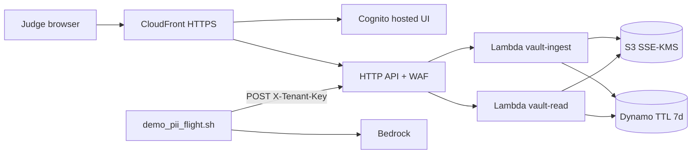
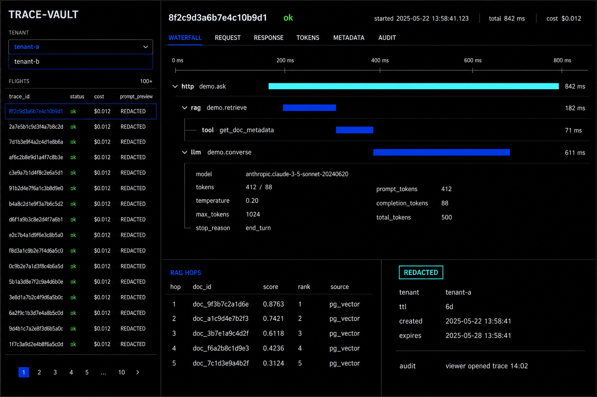

# TraceVault — hackathon plan

**Theme (P-02):** Unified AI Observability. **Product:** AI Application Flight Recorder. **Team (P-01):** Trevor, Alexis, Michael (3 ≤ 5).

This file is the team plan. Everything below is in here on purpose.

| Section | What it is |
|---|---|
| Done-bar | 48h production SaaS yes/no |
| Judge path | What judges click |
| Winners steal | What we copy from last year |
| Stack | Languages, AWS, brand tokens |
| Three-person work | Who builds what |
| HTTP + auth | Routes, JWT, CORS, two Lambdas |
| Security + governance | 48h AWS prod bar, assigned; not SOC2 |
| Handbook | 2026 judge P-01–P-15, threat model, system card |
| Skills format | Parallel agents, same files, your content |
| Start | Pull → “ok let’s start”: `START.md` (Alexis/Michael fill their own skills) |
| Tree | Product repo layout |
| Git / CI | Branches, Trevor merges, checks |
| Handoffs | One committed file per PR; claimed paths = collision |
| Prep | Before the clock |
| 48h table | Hour-by-hour |
| Look | Explorer target (not Grafana) |
| Brand | Mark files |

**This GitHub repo is a scratchpad.** `https://github.com/Sighopss/TVault-scratchbook-accessible` is plan, brand, and skills. No `sdk/`, `vault/`, `web/`, `infra/`, or deploy here. After clone, humans tell their LLM “ok let’s start” — [`START.md`](START.md). Alexis and Michael **fill their own** constitutions ([`skills/FILL-CONSTITUTION.md`](skills/FILL-CONSTITUTION.md)); Trevor does not write those folders.

**Product repo:** Trevor creates a new GitHub repo. That is the only app. Copy this plan + skills into it. Git/CI rules apply **there**.

Hour 0 also writes `contracts/http.md` by copying **HTTP + auth** below, and `contracts/span.schema.json` from [`skills/trevor-recorder/span.schema.draft.json`](skills/trevor-recorder/span.schema.draft.json).

---

## Done-bar

Public HTTPS. Two Cognito tenants. Sign-in. Write + read APIs. PII never at rest. Secrets not in git. UI and API both live. `GET /health` 200. 5xx alarm. Rollback = re-run last green `deploy.yml`. Controls: **Security + governance** below.

**Do not build:** custom domain, multi-region, PITR, CloudTrail, GuardDuty, VPC-for-Lambda, MFA (breaks one-shot judge login), billing, SOC2 binder, pager, RCA-via-Bedrock.

Kill if time slips: welcome copy extras → RCA → extra cost charts (keep one `$`) → extra span kinds. **Never kill:** redaction, 403, HTTPS URL, fixture UI, `/health`, CORS, JWT→`custom:tenant_id`. Welcome may die; Cognito can still be the first hit.

---

## Judge path

1. Public AWS URL. **Welcome** (`/`, Michael). Sign in as **tenant-a** (Cognito hosted UI). One RAG/agent flight: spans, hops, tokens, `$`.
2. That flight’s prompt had email/SSN. Stored payload masked. Hash only. UI shows `REDACTED`.
3. Sign in as **tenant-b**. Same `trace_id` → **403**. List does not include tenant-a.
4. Audit row: who opened the trace, when. TTL mentioned.
5. `scripts/demo_pii_flight.sh` re-runs live (`tenant-a`, PII in the prompt).

---

## Winners steal

InnerAI already did “wrap the LLM and dump logs.” Minions already did Grafana KPIs. We steal their **operating system**, not their UI.

| Steal from | What we copy | What we do not copy |
|---|---|---|
| **HemoStat** | One package per person. Freeze span JSON **and** HTTP (this file’s HTTP + auth = their `API_PROTOCOL.md`) before lane code. Fail-closed. One demo script. `uv` + Makefile. | Streamlit. Prometheus theater. |
| **VRA** | Isolated ingest. Security as a test judges watch fail (PII at rest, cross-tenant 403). | AKS. Leftover Next dump. |
| **InnerAI** | SDK wraps the model call. Four-way split: emit, vault, UI, demo user. | Plaintext prompts. Localhost-only. No tenants. |
| **Minions** | CI deploys the **demo** and the **UI**, not just infra. `gen_ai.*` names. (They used SSH `:22` + compose — we use OIDC + `deploy.yml` on `main`.) | Grafana as the product. SSH. |
| **GenA11y** | Terraform from hour 0. Public URL on the slide. Tiny scope. | EC2. SSH `:22`. AKIA. Deploy on every push. |

Trap: a wrapper + dashboards with no redaction is a weaker InnerAI. Governance is the scoring surface.

---

## Stack

| Layer | Choice |
|---|---|
| Contract | JSON Schema 2020-12 + HTTP + auth (this file) |
| SDK + demo + vault | Python 3.12, `uv` |
| UI | TypeScript 5.8, Next.js 15 App Router, `pnpm`, `output: 'export'` |
| IaC | Terraform >= 1.9, AWS, `us-east-1` |
| CI | GitHub Actions, OIDC, no AKIA — **Trevor** (`trevor-ci`) |
| Demo LLM | Bedrock Claude or Nova |
| Shell | GNU coreutils, WSL2, no PowerShell |

Python pins: `pydantic>=2`, `boto3`, `presidio-analyzer`, `presidio-anonymizer`, `opentelemetry-api` (shape only), `httpx`, `pytest`, `bandit`. Web: React 19, Playwright. AWS: HTTP API, two Lambdas, S3 SSE-KMS, DynamoDB TTL 7d, Cognito, CloudFront, WAF, Secrets Manager. PITR off. CloudTrail off.

**Hard no:** EKS/AKS, OpenSearch, Langfuse/Phoenix store, Streamlit, Grafana UI, X-Ray SDK, stock OTLP (persists raw prompts), SSH `:22`.

---

## Three-person work

Challenge ideas are **views**, not extra apps. One flight = one `trace_id` with spans `llm|tool|rag|http`.

| | Trevor | Alexis | Michael |
|---|---|---|---|
| Lane | Recorder + AWS | Vault | Explorer |
| Git | `sdk/` `demo-app/` `infra/` `scripts/` `.github/` `Makefile` | `vault/` | `web/` `PRODUCT.md` `DESIGN.md` |
| CI/CD | **Trevor only** — GHA + Makefile (`trevor-ci`) | tests `vault.yml` runs | tests `web.yml` runs |
| Language | Python + Terraform + GHA | Python 3.12 Lambda | TypeScript / Next.js 15 |
| Unblocks | Live traces + URL | Storage that cannot leak | The screen judges stare at |
| Tasks | **7** (repo/CI, SDK, demo, script, Terraform, URL) | **7** (redact, store, ingest, read, audit, HTTP, tests) | **7** (PRODUCT, welcome, list, waterfall, chrome, data, e2e) |

Shared, hour 0 only, all three: `contracts/`. After that, that tree needs all three on the PR.

Same count on purpose. Vault is not a light lane — PLAN used to hide it in four bullets. Nobody picks up another human’s tree to “balance.”

### Trevor

1. Product GitHub repo. Branch protection. OIDC. Copy plan + skills. Bootstrap Terraform remote state (S3 + lock) once.
2. CI/CD (`trevor-ci`): `.github/` + `Makefile` — `gitleaks`, `trivy`, **`make sbom`** (CycloneDX CI artifact, not secrets), `sdk.yml`, `vault.yml`, `web.yml`, `infra.yml`, `deploy.yml`. Rollback = re-run last green deploy. Alexis/Michael do **not** author workflow YAML.
3. `sdk/tracevault/`: `start_span` / `end_span` around Bedrock converse + one RAG retrieve. Tokens + `cost_usd`. `sensitive=True` hashes/masks before logs. Alexis still redacts at ingest.
4. `demo-app/`: small corpus, **one** retrieve tool (allowlist — no write/delete tools), one LLM answer. Two tenant keys. Timeouts so the agent cannot loop unbounded.
5. `scripts/demo_pii_flight.sh`: `tenant-a`, email + fake SSN in the prompt.
6. Terraform per **HTTP + auth** and **Security + governance**: CORS, JWT, ingest key, `/health`, two Lambdas, Cognito, CloudFront HTTPS-only + headers, WAF, KMS, secrets placeholders, logs 7d, 5xx alarm, OIDC, throttle. Outputs for `NEXT_PUBLIC_*`.
7. Keep the URL alive (re-run last green `deploy.yml` if it dies). Makefile help **is** the runbook: health, tenants, rollback, where logs live. No secrets in it.

### Alexis

0. Your LLM fills **your** constitution. “Ok let’s start” → [`START.md`](START.md) + [`skills/FILL-CONSTITUTION.md`](skills/FILL-CONSTITUTION.md). Copy `skills/lane-constitution/` → `skills/<your-lane>/`. Write **your** `SKILL.md` and **one mission file per numbered task below**. Keep writing into `progress.md`. Trevor does **not** write this folder. Do not copy `trevor-recorder/`. Do not write `web/` or `infra/`.
1. `vault/redact/`: Presidio + deny-list (SSN, email, AWS keys, `sk-`). Prompt → `prompt_hash` + masked `prompt_preview`. Fail-closed → `RedactionError` (ingest maps to `redaction_failed`, nothing stored).
2. `vault/store/`: S3 `{tenant_id}/{trace_id}/` SSE-KMS, Dynamo PK/SK, TTL `expires_at` 7d. No partial write. Persist Trevor’s `cost_usd` / tokens — do not invent them.
3. `vault/ingest/` + `vault/handlers/ingest.py`: `POST /v1/traces`, `X-Tenant-Key` → tenant, schema validate, redact, store, `202`.
4. `vault/read/` + `vault/handlers/read.py`: `GET /v1/traces` and `GET /v1/traces/{trace_id}`. JWT `custom:tenant_id`. Mismatch → **403 not 404**. `limit` max 50.
5. `vault/audit/`: GET detail writes a row. `GET .../audit` returns `{events:[{actor,tenant_id,trace_id,ts}]}` tenant-scoped.
6. HTTP **error JSON** exactly (`unauthorized` / `forbidden` / `invalid` / `redaction_failed`). `message` never contains PII, prompts, or keys.
7. Tests (VRA style, `vault.yml` runs them): SSN/email/`AKIA` never in stored JSON; tenant-a JWT cannot read tenant-b; missing auth → 401; redact fail → 400 and store not called. Adversarial: prompt that tries to exfiltrate PII still has no raw PII at rest.

### Michael

0. Same constitution fill as Alexis (`START.md` + `FILL-CONSTITUTION.md`). Then Impeccable: `/impeccable init` → `PRODUCT.md` (Operate), hooks on, `/impeccable shape` **before** components. Draft at the end of this section. Do not open `web/` until `PRODUCT.md` exists. Trevor does **not** write your skills. Do not write `vault/`.
1. `PRODUCT.md` + shape: welcome, list, waterfall, audit/tenant strip (Operate, brand tokens).
2. Welcome `/` (unauthenticated): mark, one-line what this is, one-line limitation (prompts stored masked, TTL 7d), Sign in → Cognito hosted UI. One route, not a campaign site.
3. Flight list (signed in). Detail via `?trace_id=` (no dynamic `[id]`). Next.js 15, `output: 'export'`.
4. Waterfall (parent-child, latency, tokens, `$`) + RAG hops (masked query, doc ids, scores).
5. Audit/tenant strip: badges `REDACTED` / tenant / TTL, tenant switcher, 403 UI from contracted error JSON.
6. Day 1: `contracts/fixtures/tenant-a-rag.json` only. Day 2: fetcher → `GET /v1/traces*`. Env from Trevor: `NEXT_PUBLIC_*`. No hardcoded URLs.
7. Playwright: fixture A renders; fixture B hides SSN; live tenant-b 403. After first real page: `/impeccable document` → `DESIGN.md`. Finish: `/impeccable harden` then `audit`.

```markdown
# Product
<!-- impeccable:product-schema 1 -->
## Platform
web
## Stack
Next.js 15 App Router, output export, Cognito hosted UI, fixtures then GET /v1/traces*.
## Users
On-call ML/SRE reconstructing one AI request. One welcome gate at `/`, then operate. Not a campaign site.
## Product Purpose
Replay one request (LLM, tools, RAG, cost, errors) without storing raw prompts or PII.
## Positioning
Write-time redaction, tenant isolation. Not Grafana. Not Langfuse.
## Constraints
Raw prompts never persist. Cross-tenant 403. Every view audited. DynamoDB TTL. TraceVault black/blue/cyan. Unauthenticated `/` is welcome + Sign in only — no extra marketing routes.
## Terminology
Flight = one trace. Kinds: llm, tool, rag, http.
```

---

## HTTP + auth

Hour 0: copy this whole section into the product repo as `contracts/http.md` (also kept as [`contracts/http.draft.md`](contracts/http.draft.md)). Do not invent a second API.

### Auth

| Surface | Auth | Who |
|---|---|---|
| `POST /v1/traces` | `X-Tenant-Key` only. Key → `tenant-a` or `tenant-b` via Secrets Manager. | Trevor provisions. Alexis validates and maps key → `tenant_id`. |
| `GET /v1/traces*` | `Authorization: Bearer <Cognito access token>` | Trevor: pool, app client, hosted UI domain, callback = CloudFront URL, `custom:tenant_id`. Alexis: JWT `custom:tenant_id` must match stored tenant. Mismatch → **403** (not 404). |
| `GET /health` | none | Trevor: API Gateway mock. No Lambda. |

Ingest is **not** Cognito. Users `tenant-a` and `tenant-b` have `custom:tenant_id` = username. Passwords via `TF_VAR_*`, not git. No force-change-on-first-login (judges sign in once).

### Error JSON

```json
{ "error": { "code": "unauthorized", "message": "auth required" } }
```

`code`: `unauthorized` (401), `forbidden` (403), `not_found` (404), `invalid` (400), `redaction_failed` (400, fail-closed, nothing stored). `message` never contains PII, prompts, or keys.

### Routes

| Method | Path | Auth | Code | AWS | Success |
|---|---|---|---|---|---|
| `GET` | `/health` | none | — | Trevor mock | `200 {"ok":true}` |
| `POST` | `/v1/traces` | tenant key | Alexis ingest→redact→store | `vault-ingest` | `202 {"accepted":true,"trace_id":"<id>"}` |
| `GET` | `/v1/traces?limit=50` | JWT | Alexis read | `vault-read` | `200 {"flights":[...]}` |
| `GET` | `/v1/traces/{trace_id}` | JWT | Alexis read | `vault-read` | `200 {"trace_id","tenant_id","expires_at","spans":[...]}` |
| `GET` | `/v1/traces/{trace_id}/audit` | JWT | Alexis audit | `vault-read` | `200 {"events":[{"actor","tenant_id","trace_id","ts"}]}` |
| `OPTIONS` | those paths | CORS | — | Trevor | 204 |

List `flights[]`: `trace_id`, `tenant_id`, `start_time`, `end_time`, `cost_usd`, `status`, `prompt_preview`. Tenant-scoped from JWT. `limit` max 50. Get spans = span schema. Audit GET also **writes** a row.

### CORS (Trevor)

Allow origin = CloudFront URL only (not `*`). Methods `GET,POST,OPTIONS`. Headers `Authorization,Content-Type,X-Tenant-Key`. Credentials off.

### Two Lambdas, five packages

Alexis writes `vault/{ingest,redact,store,read,audit}/`. Trevor does **not** create five functions.

- `vault-ingest` → `vault.handlers.ingest.handler`
- `vault-read` → `vault.handlers.read.handler`

Trevor zips `vault/`. Alexis owns the handler files.

### Web env (Michael)

```
NEXT_PUBLIC_API_URL
NEXT_PUBLIC_COGNITO_REGION
NEXT_PUBLIC_COGNITO_USER_POOL_ID
NEXT_PUBLIC_COGNITO_CLIENT_ID
NEXT_PUBLIC_COGNITO_DOMAIN
```

Tokens in memory or sessionStorage. Trevor outputs these values. Michael does not hardcode URLs.

---

## Security + governance

48h **production SaaS** on AWS. Not a SOC2 program. If a control is not in this table, do not invent it. Owners implement it in **their** tree; Trevor does not write `vault/` Python; Alexis/Michael do not write Terraform.

Last year: InnerAI stored plaintext prompts; Minions/GenA11y used SSH and AKIA. We do not.

### Must ship

| Control | Owner | What “done” is |
|---|---|---|
| PII never at rest | Alexis | Presidio + deny-list (SSN, email, `AKIA`, `sk-`). Fail-closed: `redaction_failed` 400, **nothing stored**. Prompt → `prompt_hash` + masked `prompt_preview` only. |
| Tenant isolation | Alexis + Trevor | Trevor: two Cognito users, `custom:tenant_id`, ingest keys in Secrets Manager. Alexis: JWT tenant must match stored tenant → **403 not 404**. List scoped. Tests judges can watch fail. |
| Audit + retention | Alexis + Trevor | GET of a trace **writes** an audit row. Dynamo TTL 7d (`expires_at`). Lambda logs 7d. No raw prompts in logs (Trevor SDK `sensitive=True`; Alexis never logs the raw body). |
| Secrets | Trevor | No secrets in git. `TF_VAR_*` / Secrets Manager. GitHub Actions **OIDC only** — if you type `AKIA`, stop. gitleaks on every PR. |
| Encryption | Trevor | S3 + Dynamo **SSE-KMS**. In transit: CloudFront **HTTPS-only** (redirect HTTP). API Gateway HTTPS. |
| Perimeter | Trevor | S3 **public access block** + CloudFront **OAC** (no public website endpoint). CORS origin = CloudFront URL only, not `*`. **No SSH `:22`**. WAF on the HTTP API (AWS managed common rules). API throttle (demo-sized; do not leave unlimited). |
| IAM | Trevor | No `s3:*` / `dynamodb:*` on `*`. Ingest Put under `{tenant_id}/`. Read Get/Query only. Bedrock invoke scoped to the model ids in tfvars. OIDC role limited to this stack. |
| Headers | Trevor | CloudFront response headers: CSP (`default-src 'self'`, `connect-src` API), **HSTS**, `X-Content-Type-Options: nosniff`. |
| AppSec CI | Trevor YAML; Alexis/Michael tests | gitleaks, trivy, bandit, `vault.yml` isolation/SSN, Playwright 403. Deploy **`main` only**. Rollback = re-run last green `deploy.yml`. |
| UI must not leak | Michael | Fixtures and live views never show raw SSN/email. 403 from contracted JSON. Tokens in memory or sessionStorage, not git. |

Health: `GET /health` 200. Alarm: API 5xx ≥ 5 in 5 minutes. Tags on AWS resources: `Project=TraceVault`, `Env=dev|prod`.

### Do not build (still)

CloudTrail, GuardDuty, Security Hub, VPC-attached Lambdas, PITR, MFA on judge users, custom domain, WAF on CloudFront unless the API WAF is already green and time remains, SNS pager, AWS Config rules, SOC2 docs.

Alexis/Michael: put **your** rows into `enterprise.md` when you fill the constitution. Trevor: `skills/trevor-recorder/enterprise.md` + `agents/infra.md`.

---

## Handbook (2026)

Source: *DevOps for GenAI Hackathon 2026 Participant & Judge Guidelines*. Production path, not a screenshot demo. Grafana is still not the UI — **this product is the observability evidence** (traces + `/health` + 5xx alarm).

### Problem and metrics (P-03)

**Problem:** On-call cannot reconstruct one AI request (LLM, RAG, tools, cost) without the observability stack becoming a data leak.

**Outcomes judges can measure:**

1. Public URL; `GET /health` → `200 {"ok":true}`
2. One flight: waterfall + hops + tokens + `$`
3. Synthetic email/SSN in the prompt → **zero** raw PII at rest; UI `REDACTED`
4. `tenant-b` + tenant-a `trace_id` → **403**

### Participant map (P-01–P-15)

| ID | Requirement | We do | Owner / evidence |
|---|---|---|---|
| P-01 | 1–5 members | 3 | This file |
| P-02 | One theme | Unified AI Observability | README + this file |
| P-03 | Problem + metrics | Four outcomes above | Judge path |
| P-04 | Live use case | CloudFront URL | Trevor 7 |
| P-05 | Production path | Terraform + `deploy.yml` + runbook in Makefile help | Trevor 2+6+7 |
| P-06 | AI transparency | `AI_USAGE.md` in the **product** repo | All three append D2 |
| P-07 | Security by design | Threat model + tests below | Alexis 7, Trevor CI, Michael 7 |
| P-08 | Governance | System card below | This section |
| P-09 | Tests | Functional + security + failure | `sdk.yml` `vault.yml` `web.yml` |
| P-10 | Observability | Flights (traces), Lambda logs 7d, 5xx alarm, `cost_usd` | Product + Trevor CloudWatch |
| P-11 | Reproducible, no secrets | Product README + `.tfvars.example` | Trevor |
| P-12 | Responsible AI | System card: privacy, no autonomous actions, human views traces | This section |
| P-13 | No secrets in git | gitleaks fail-closed; OIDC | Trevor 2 |
| P-14 | Supply chain | `trivy fs` + `make sbom` (CycloneDX artifact, not committed secrets) | Trevor 2 |
| P-15 | Demo integrity | **Demo notes** below — fixtures vs live vs fake Bedrock | All three |

### Architecture (P-05)



Trust boundary: ingest key ≠ user JWT. Demo tool = **retrieve-only** (allowlist of one). No write/delete tools. No SSH.

### Threat model (P-07) — OWASP LLM / agentic

| Threat | Mitigation | Test owner |
|---|---|---|
| Sensitive disclosure (prompts/PII at rest or in logs) | Fail-closed redaction; hash+mask; SDK `sensitive=True` | Alexis 7, Trevor 3 |
| Cross-tenant read | JWT `custom:tenant_id`; **403 not 404** | Alexis 7, Michael 7 |
| Prompt injection / instruction conflict | Schema-only ingest; one retrieve tool; still redact at rest | Alexis 7 (payload never stores attacker’s raw PII); Trevor 4 no extra tools |
| Secrets in git / CI | gitleaks; OIDC; Secrets Manager | Trevor 2 |
| Unlimited API / cost | API throttle; Lambda timeout; `cost_usd` on spans | Trevor 6 |
| Unsafe agent tools | Allowlist: RAG retrieve only. No confirm-needed writes because there are no write tools | Trevor 4 |
| Supply chain | trivy + sbom artifact | Trevor 2 |
| Ingest down | SDK writes `sdk/.last-flight.json`, no crash | Trevor 3 |
| Redaction fail | 400 `redaction_failed`, nothing stored | Alexis 1+7 |

Red-team **show one attack** (handbook): SSN in prompt → stored JSON has no SSN. Second: tenant-b 403.

### System card (P-08, P-12)

| Field | Value |
|---|---|
| Intended use | On-call reconstructs **one** AI request |
| Users | `tenant-a` / `tenant-b` (judges). Not end-customers’ raw prod traffic in 48h |
| Non-goals | Grafana, fleet KPIs, autonomous remediation, RCA-via-Bedrock, custom domain |
| Prohibited | Storing raw prompts/PII; cross-tenant peek; AKIA in git |
| Risk | **High** if prompts persist → fail-closed redaction is the control |
| Data | Synthetic demo PII only. Sources: demo prompt + Bedrock output. Retention **7d TTL**. Permitted use: reconstruct that flight |
| Human oversight | Humans view traces. No agent changes infra. Escalation: Trevor re-runs last green `deploy.yml`. No pager (48h non-goal) |
| Transparency | UI: `REDACTED`, model name, tokens, `$`, TTL. Welcome: one-line limitation (masked prompts, 7d) |
| Model/provider | Amazon Bedrock Claude **or** Nova, `us-east-1`. Exact id in tfvars / `BEDROCK_MODEL_ID` — record in `AI_USAGE.md` |
| Monitoring | `/health`, API 5xx alarm, flights in Explorer |
| Change | Feature PR; Trevor merges; `contracts/` needs all three |
| Incident | Redaction fail = nothing stored. Site down = rollback `deploy.yml`. Compromised key = rotate Secrets Manager (Trevor) |

### Demo notes (P-15)

| Piece | Live | Stub |
|---|---|---|
| CloudFront, Cognito, API, KMS, Dynamo, S3 | Live after apply | — |
| Presidio on ingest | Live | — |
| Bedrock | Live unless `TRACEVAULT_FAKE_BEDROCK=1` | **Say so** if fake |
| Explorer Day 1 | — | Full-flight **fixtures** (say so) |
| Explorer Day 2 | `GET /v1/traces*` | — |

### Submission pack (D2 PM — do not skip)

Handbook §6. Owners copy into the **product** repo README:

1–3, 20: name, theme, pitch, problem, roster — **PLAN** (this file)  
4: architecture — mermaid above  
5–6: URL + product GitHub — Trevor  
7–8: tech + `AI_USAGE.md` — all three  
9–10: this threat model + Alexis/Trevor/Michael tests  
11: system card above  
12–16: GHA green, gitleaks, trivy/sbom artifact  
17: Makefile help = runbook  
18: judge path live  
19: limitations = Do-not-build list  

---

## Skills format

Same **format** for all three. Different **content**. That is what enforces parallel LLMs and three-person handoffs.

Alexis and Michael fill their own folders. Procedure: [`START.md`](START.md) + [`skills/FILL-CONSTITUTION.md`](skills/FILL-CONSTITUTION.md). Copy [`skills/lane-constitution/`](skills/lane-constitution/) to `skills/<your-lane>/`. Keep every filename. Fill placeholders from **your** PLAN section. Write **your** `SKILL.md` and `agents/<mission>.md`. After each session, append `progress.md`. Do **not** clone [`skills/trevor-recorder/`](skills/trevor-recorder/) (Trevor’s missions, paths, APIs). Trevor does not author those two folders.

```text
skills/<your-lane>/
  SKILL.md
  ownership.md
  parallel.md
  stack.md
  enterprise.md
  handoffs.md
  workflow.md
  progress.md
  agents/<mission>.md
```

Mirror `SKILL.md` to `.cursor/skills/<your-lane>/`, `.claude/skills/<your-lane>/`, `.kiro/skills/<your-lane>/`. Add paste blocks to `AGENTS.md`. Register in `skills/INDEX.md`.

**Parallel (do not rewrite lease/worktree rules):**

- One agent id, one mission file, one path set.
- Lease in repo-root `.agent-leases.json` (all lanes share it, gitignored). Overlap + started < 4h ago → stop. Do not delete someone else’s lease.
- **Per PR:** commit `handoffs/<name>-<id>-<slug>.md` (see [`handoffs/README.md`](handoffs/README.md)). Paste it in the PR body. Before write: `gh pr list` — overlapping **Claimed paths** → stop. Local leases do not see other laptops.
- `git worktree add .worktrees/<name>-<id> -b <name>/<id>/<slug>`
- Open a PR. **Do not merge — Trevor merges.**
- Need another lane → that handoff file on the PR, then stop.

Paste:

```
You are <your-name>-<id>.
Read PLAN.md, handoffs/README.md, and skills/<your-lane>/SKILL.md.
gh pr list --state open. If claimed paths overlap yours, stop.
Execute skills/<your-lane>/agents/<id>.md only.
Commit handoffs/<your-name>-<id>-<slug>.md on this PR.
Do not commit unless I ask. Do not merge to main — Trevor merges.
Do not edit paths PLAN.md assigns to someone else.
```

Trevor’s agent ids (his folder only): `trevor-sdk`, `trevor-demo`, `trevor-scripts`, `trevor-infra`, `trevor-ci`.

---

## Tree

```text
contracts/span.schema.json
contracts/http.md
contracts/fixtures/tenant-a-rag.json    # full flight, not one span
contracts/fixtures/tenant-b-pii.json
sdk/                 # Trevor
demo-app/            # Trevor
vault/{ingest,redact,store,read,audit,handlers}/   # Alexis
web/                 # Michael
infra/               # Trevor
scripts/demo_pii_flight.sh
.github/workflows/
Makefile
PLAN.md  PRODUCT.md  DESIGN.md  AGENTS.md  START.md
handoffs/README.md  handoffs/PR.example.md  handoffs/<name>-<id>-<slug>.md   # one file per PR
skills/INDEX.md
skills/lane-constitution/
skills/trevor-recorder/
skills/<alexis-lane>/
skills/<michael-lane>/
```

---

## Git / CI

**Owner: Trevor.** Agent id `trevor-ci`. Writes `.github/` and `Makefile`. Mission: [`skills/trevor-recorder/agents/ci.md`](skills/trevor-recorder/agents/ci.md). Alexis owns tests under `vault/` (job `vault.yml` runs them). Michael owns tests under `web/` (job `web.yml` runs them). Neither writes Actions YAML.

`main` protected. Feature branch + PR. Humans: `alexis/<slug>`, `michael/<slug>`, `trevor/<slug>`. Trevor agents: `trevor/<id>/<slug>`. **Only Trevor merges.** Schema/`http.md` PRs: all three in the thread. No push to `main`. No deploy from feature branches. No CodePipeline. No per-PR stacks.

Every PR: committed `handoffs/<name>-<id>-<slug>.md` + same text in the PR body ([`.github/pull_request_template.md`](.github/pull_request_template.md)). Collision = claimed-path overlap with an **open** PR, or local lease overlap.

### What last year actually ran (steal OS, not their deploy)

Checked `CanadaDevOpsCommunity2025` repos:

| Repo | What CI/CD was | Steal | Do not copy |
|---|---|---|---|
| **HemoStat** | `Makefile` + `uv`. GHA was hourly Sphinx that **commits docs to main**. | Unix Makefile, `uv`, skip-if-missing targets. | Docs auto-commit, `windows-*` make, Grafana provision YAML. |
| **Minions** | `redeploy.yaml` on `main`: SSH `:22` + `docker compose` the **demo**. | CI deploys the thing judges hit (our `demo-app` tests + `web/` sync), not only Terraform. | SSH, Docker-on-a-box, echo secrets in logs. |
| **GenA11yHelper** | `deploy.yml` on **every push** → Docker Hub → SSH EC2. `promote.yml` used **AKIA**. | Terraform in the pipeline. Curl the public URL after apply. | EC2, `:22`, AKIA, deploy on every feature push. |
| **VRA** | No `.github/workflows`. Security lived in pytest (`test_hmac.py`). | Security as a **required check** (`vault.yml` SSN/403). | No pipeline. |
| **InnerAI** | No GHA. `fastapi dev` + CSV. | Nothing. | Localhost-only. |

Ours: GitHub Actions + **OIDC** (no AKIA). Deploy **`main` only**. Rollback = re-run last green `deploy.yml`.

### CODEOWNERS

```
/contracts/  @trevor @alexis @michael
/sdk/ /demo-app/ /infra/ /scripts/ /Makefile /.github/  @trevor
/vault/      @alexis
/web/ /PRODUCT.md /DESIGN.md  @michael
```

| Trigger | Job | Owner of YAML | Owner of code under test |
|---|---|---|---|
| Any PR | gitleaks, trivy | Trevor | all |
| `vault/**` | pytest + bandit (SSN fail-closed) | Trevor | Alexis |
| `web/**` | lint + Playwright | Trevor | Michael |
| `sdk/**` `demo-app/**` | golden span vs schema | Trevor | Trevor |
| `infra/**` | terraform plan | Trevor | Trevor |
| `main` | apply dev (prod if approved) → sync web → invalidate | Trevor | — |

---

## Prep

**All three:** GNU coreutils on PATH (`C:\Program Files\coreutils\bin`). WSL2 for runs. Cursor hook strips PowerShell `ls`/`cat` aliases. CI pins: Python 3.12, Node 22, Terraform 1.9, `uv`, `pnpm@9`.

**Trevor:** AWS account + OIDC role. Bedrock enabled `us-east-1`. Product repo + protection + empty CI. Remote-state bucket + lock table. Confirm Alexis/Michael have coreutils, WSL, Impeccable (Michael).

**Alexis:** Least-privilege AWS (not root in Cursor). Presidio hello-world (SSN, email, AWS key). Deny-list on paper. Skill folder filled **by your LLM** (`FILL-CONSTITUTION.md`). HTTP + auth section read.

**Michael:** Impeccable skill loaded. Skill folder filled **by your LLM**. `PRODUCT.md` written (product repo).

**Hour 0 (90 min, together):** lock `span.schema.json` + `http.md` (copy HTTP + auth) + both **full flight** fixtures. No lane code before that.

---

## 48h table

| Window | Trevor | Alexis | Michael |
|---|---|---|---|
| −1 | Repo, OIDC, empty CI | Skills + Presidio hello-world + deny-list | Skills + Impeccable init + PRODUCT shape |
| 0 | Schema + http.md; callback URL | **1 redact** cases on contract | Fixture wireframe; `NEXT_PUBLIC_*` names |
| D1 AM | **3–4** SDK + demo emit | **2–3** store + ingest handler | **2–4** Welcome + list + waterfall on fixtures |
| D1 PM | **6** CORS + two Lambdas | **1+5** Presidio wired + audit GET | **5** Cost + tenant switcher + 403 chrome |
| Night | **2+7** `deploy.yml`: `/health`, alarm | **7** Isolation tests (403/SSN/401) | **7** Harden 403/empty; export build |
| D2 AM | URL + web sync + two users | Live S3 leak tests (still **7**) | **6–7** Live API + Playwright 403 |
| D2 PM | URL alive; rollback drill; `AI_USAGE.md` | Judge governance + adversarial test evidence | Click-through; welcome limitation line |

---

## Look

This is the Explorer target for the 48 hours: **welcome `/`** (Sign in) → reconstruct **one AI request** (list → waterfall → hops → `$` → `REDACTED`). Not a Grafana KPI wall. Michael owns welcome + Explorer (Impeccable Operate). Same brand tokens as **Brand**.



---

## Brand

Background `#000000`. Text `#F8F8F8`. Blue `rgb(0, 8, 248)`. Cyan `rgb(0, 248, 248)`. Impeccable **Operate**. No cream Inter dashboard, metric-card walls, glassmorphism, Streamlit look.


| File | What |
|---|---|
| `assets/tracevault-explorer-sample.png` | Explorer look (how the product should look) |
| `assets/Hackathon_Trace Vault_1.1_Summer 2026.jpg` | Original submitted mark |
| `assets/tracevault-approved-source.png` | Approved source |
| `assets/Hackathon_Trace Vault_1.1_Summer 2026_enterprise.png` | Production PNG |
| `assets/Hackathon_Trace Vault_1.1_Summer 2026_enterprise.jpg` | Production JPG |
| `assets/Hackathon_Trace Vault_1.1_Summer 2026_enterprise.pdf` | Production PDF |
